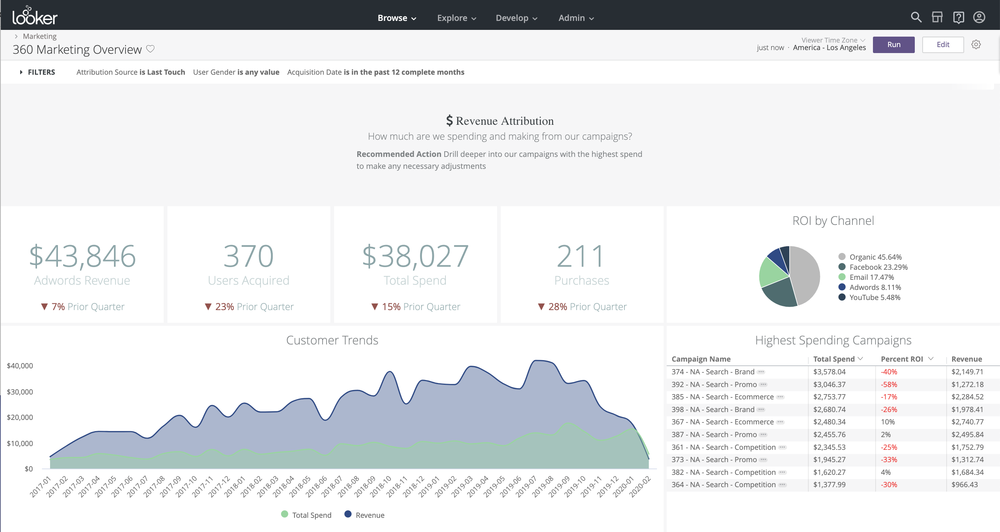
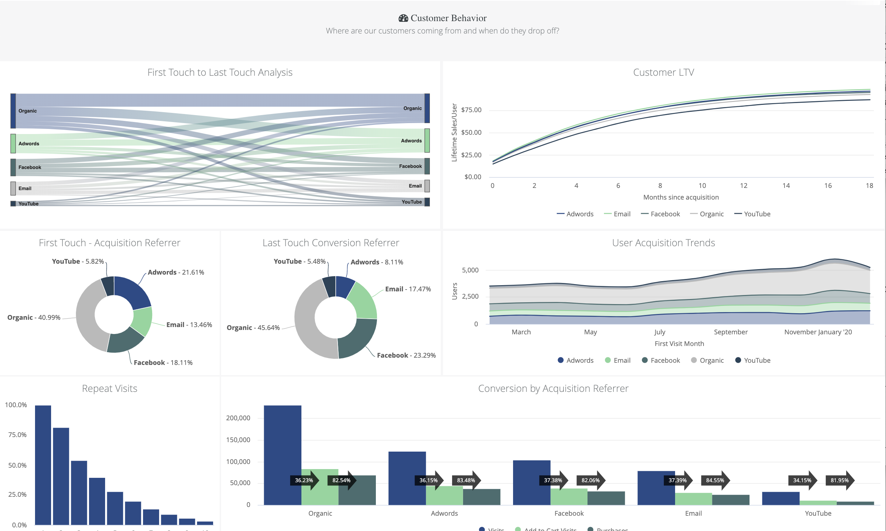
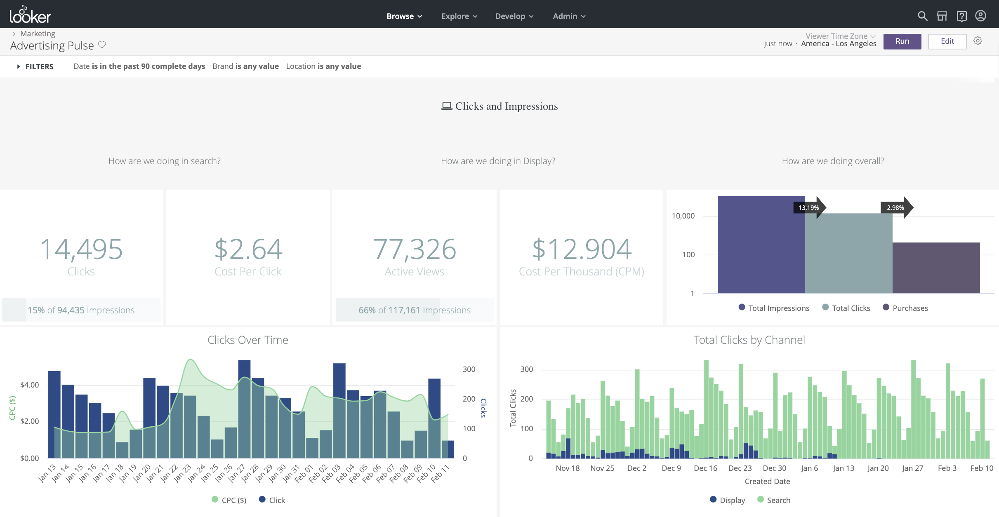
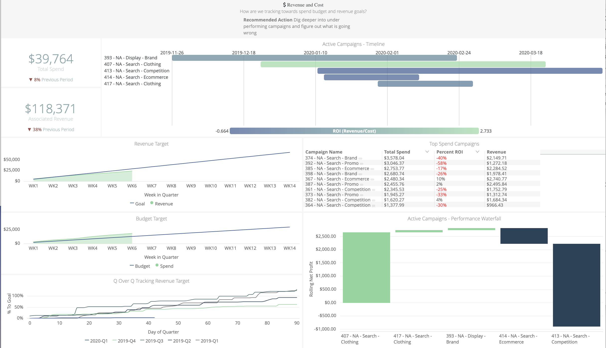
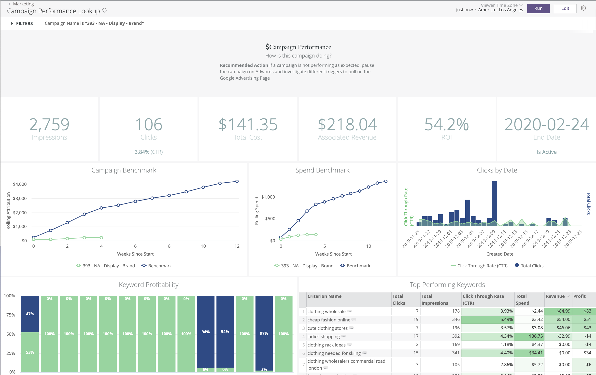

# Marketing Demo

This repository contains the Snowflake based LookML, for both the model and dashboards, for demonstrating Looker’s ability to provide value within the digital marketing landscape.

## How to Use
If you are a Looker partner, please reach out to your analyst for access to dummy data. If you are an internal Looker user, please submit a helpdesk ticket to get credentials to the demo database.

#### Standard Users
**Option 1) Cloning from this repository:**
Do this if you want to stay up-to-date on changes to the model and do not plan on customizing for your own needs. See steps [here](https://docs.looker.com/data-modeling/getting-started/create-projects#clone_repo).

#### Advanced Users
**Option 2) Project import (preferred):**
Do this if you want to extend the model and make changes within your Looker instance. Existing LookML will still be available to view. Follow these steps [here](https://docs.looker.com/data-modeling/learning-lookml/importing-projects).

**Option 3) Duplicating this repository:**
Do this if you want to make your own copy of the model to directly modify within your Looker instance. Follow these steps, or download the files [here](https://www.nomachetejuggling.com/2011/09/12/moving-one-git-repo-into-another-as-subdirectory/) and upload into your own github repository within the UI.

## Description

This demo uses dummy data from Google Adwords, as well as Ecommerce clothing store order data, to show things like digital marketing attribution and campaign ROI.

The LookML model is divided into a few folders:

 
**Dashboards:**

306 Marketing Overview:

Advertising Pulse:

Campaign Performance Lookup:

